# Coin项目数据库设计文档

> 更新时间：2025-11-23 18:05:00
> 版本：1.0.0
> 数据库引擎：MySQL 8.0+
> 字符集：utf8mb4

## 数据库概览

Coin项目数据库采用关系型数据库设计，包含完整的用户管理、资产管理、交易处理、算力管理、空投活动、任务系统、邀请奖励、聊天系统等核心功能模块。

## 数据库结构图

```mermaid
erDiagram
    users ||--o{ user_sessions : has
    users ||--o{ user_security_questions : has
    users ||--o{ user_assets : owns
    users ||--o{ transactions : makes
    users ||--o{ orders : places
    users ||--o{ user_power_records : owns
    users ||--o{ withdrawal_requests : submits
    users ||--o{ airdrop_participations : participates
    users ||--o{ user_tasks : completes
    users ||--o{ invite_records : invites
    users ||--o{ user_messages : receives
    users ||--o{ chat_conversations : chats
    users ||--o{ kyc_applications : applies
    users ||--o{ new_user_benefits : claims
    users ||--o{ operation_logs : performs
    users ||--o{ error_logs : generates

    users ||--o{ invite_records : inviter
    users ||--o{ invite_records : invitee

    power_packages ||--o{ user_power_records : used_in
    power_packages ||--o{ orders : contains

    airdrop_configs ||--o{ airdrop_rounds : has
    airdrop_rounds ||--o{ airdrop_participations : recorded_in
    airdrop_configs ||--o{ airdrop_participations : config

    task_configs ||--o{ user_tasks : configured_as

    invite_reward_configs ||--o{ user_invite_rewards : tracks

    chat_conversations ||--o{ chat_messages : contains

    message_configs ||--o{ user_messages : templates

    user_levels ||--o{ users : levels
```



## 核心表结构

### 1. 用户相关表

#### 1.1 users - 用户基本信息表
```sql
CREATE TABLE `users` (
    `id` BIGINT UNSIGNED NOT NULL AUTO_INCREMENT,
    `username` VARCHAR(50) NOT NULL UNIQUE,
    `email` VARCHAR(255) NULL,
    `password_hash` VARCHAR(255) NOT NULL,
    `salt` VARCHAR(255) NOT NULL,
    `user_level` TINYINT UNSIGNED NOT NULL DEFAULT 0,
    `invite_code` VARCHAR(20) NOT NULL UNIQUE,
    `inviter_id` BIGINT UNSIGNED NULL,
    `total_assets` DECIMAL(20, 8) NOT NULL DEFAULT 0.00000000,
    `dg_amount` DECIMAL(20, 8) NOT NULL DEFAULT 0.00000000,
    `is_kyc_verified` BOOLEAN NOT NULL DEFAULT FALSE,
    `is_email_verified` BOOLEAN NOT NULL DEFAULT FALSE,
    `has_security_questions` BOOLEAN NOT NULL DEFAULT FALSE,
    `is_active` BOOLEAN NOT NULL DEFAULT TRUE,
    `is_locked` BOOLEAN NOT NULL DEFAULT FALSE,
    `login_attempts` TINYINT UNSIGNED NOT NULL DEFAULT 0,
    `locked_until` TIMESTAMP NULL DEFAULT NULL,
    `avatar_url` VARCHAR(500) NULL,
    `qr_code_url` VARCHAR(500) NULL,
    `created_at` TIMESTAMP NOT NULL DEFAULT CURRENT_TIMESTAMP,
    `updated_at` TIMESTAMP NOT NULL DEFAULT CURRENT_TIMESTAMP ON UPDATE CURRENT_TIMESTAMP,
    `last_login_at` TIMESTAMP NULL DEFAULT NULL
);
```

**核心字段说明**:
- `id`: 用户唯一标识
- `username`: 用户名，唯一索引
- `password_hash`: 密码哈希值
- `salt`: 密码盐值
- `user_level`: 用户等级（0-5）
- `invite_code`: 用户邀请码
- `inviter_id`: 邀请人ID
- `is_kyc_verified`: KYC认证状态

**索引策略**:
- 主键：`id`
- 唯一索引：`username`, `invite_code`
- 普通索引：`email`, `inviter_id`, `user_level`, `is_active`

---

#### 1.2 user_sessions - 用户会话表
```sql
CREATE TABLE `user_sessions` (
    `id` BIGINT UNSIGNED NOT NULL AUTO_INCREMENT,
    `user_id` BIGINT UNSIGNED NOT NULL,
    `token` VARCHAR(512) NOT NULL UNIQUE,
    `device_info` JSON NULL,
    `ip_address` VARCHAR(45) NULL,
    `user_agent` TEXT NULL,
    `is_active` BOOLEAN NOT NULL DEFAULT TRUE,
    `expires_at` TIMESTAMP NOT NULL,
    `created_at` TIMESTAMP NOT NULL DEFAULT CURRENT_TIMESTAMP,
    `last_used_at` TIMESTAMP NOT NULL DEFAULT CURRENT_TIMESTAMP
);
```

**功能**: 管理用户登录会话，支持多设备登录

---

#### 1.3 user_security_questions - 用户安全问题表
```sql
CREATE TABLE `user_security_questions` (
    `id` BIGINT UNSIGNED NOT NULL AUTO_INCREMENT,
    `user_id` BIGINT UNSIGNED NOT NULL,
    `question_id` TINYINT UNSIGNED NOT NULL,
    `answer_hash` VARCHAR(255) NOT NULL,
    `answer_salt` VARCHAR(255) NOT NULL,
    `created_at` TIMESTAMP NOT NULL DEFAULT CURRENT_TIMESTAMP
);
```

**功能**: 存储用户设置的密保问题和答案

---

### 2. 资产相关表

#### 2.1 user_assets - 用户资产表
```sql
CREATE TABLE `user_assets` (
    `id` BIGINT UNSIGNED NOT NULL AUTO_INCREMENT,
    `user_id` BIGINT UNSIGNED NOT NULL,
    `currency` VARCHAR(20) NOT NULL,
    `balance` DECIMAL(20, 8) NOT NULL DEFAULT 0.00000000,
    `frozen_balance` DECIMAL(20, 8) NOT NULL DEFAULT 0.00000000,
    `total_earned` DECIMAL(20, 8) NOT NULL DEFAULT 0.00000000
);
```

**支持币种**:
- `USDT`: Tether稳定币
- `DG`: 平台代币
- `BTC`: 比特币
- `ETH`: 以太坊

**核心特性**:
- 支持多种数字货币
- 冻结余额功能
- 总收益统计

---

#### 2.2 transactions - 交易记录表
```sql
CREATE TABLE `transactions` (
    `id` BIGINT UNSIGNED NOT NULL AUTO_INCREMENT,
    `user_id` BIGINT UNSIGNED NOT NULL,
    `transaction_id` VARCHAR(64) NOT NULL UNIQUE,
    `type` ENUM('deposit', 'withdraw', 'exchange', 'purchase', 'airdrop', 'referral', 'task_earning', 'mining_earning') NOT NULL,
    `from_currency` VARCHAR(20) NULL,
    `to_currency` VARCHAR(20) NULL,
    `amount` DECIMAL(20, 8) NOT NULL,
    `fee` DECIMAL(20, 8) NOT NULL DEFAULT 0.00000000,
    `exchange_rate` DECIMAL(20, 8) NULL,
    `status` ENUM('pending', 'processing', 'completed', 'failed', 'cancelled') NOT NULL DEFAULT 'pending'
);
```

**交易类型**:
- `deposit`: 充值
- `withdraw`: 提现
- `exchange`: 币种兑换
- `purchase`: 算力包购买
- `airdrop`: 空投奖励
- `referral`: 邀请奖励
- `task_earning`: 任务收益
- `mining_earning`: 挖矿收益

---

### 3. 算力相关表

#### 3.1 power_packages - 算力包配置表
```sql
CREATE TABLE `power_packages` (
    `id` BIGINT UNSIGNED NOT NULL AUTO_INCREMENT,
    `name` VARCHAR(100) NOT NULL,
    `task_type` VARCHAR(100) NOT NULL,
    `required_level` TINYINT UNSIGNED NOT NULL DEFAULT 0,
    `earnings_percent` DECIMAL(10, 4) NOT NULL,
    `amount` DECIMAL(20, 8) NOT NULL,
    `currency` VARCHAR(20) NOT NULL DEFAULT 'USDT',
    `duration_days` INT UNSIGNED NOT NULL,
    `description` TEXT NOT NULL,
    `features` JSON NULL,
    `daily_earnings` DECIMAL(20, 8) NOT NULL,
    `total_earnings` DECIMAL(20, 8) NOT NULL
);
```

**算力包类型**:
- 基础算力包 (0-100 TH/s)
- 进阶算力包 (100-500 TH/s)
- 专业算力包 (500-1000 TH/s)
- 高级算力包 (1000-5000 TH/s)
- 大师算力包 (5000+ TH/s)

---

#### 3.2 user_power_records - 用户算力记录表
```sql
CREATE TABLE `user_power_records` (
    `id` BIGINT UNSIGNED NOT NULL AUTO_INCREMENT,
    `user_id` BIGINT UNSIGNED NOT NULL,
    `power_package_id` BIGINT UNSIGNED NOT NULL,
    `order_id` BIGINT UNSIGNED NULL,
    `type` VARCHAR(50) NOT NULL,
    `amount` DECIMAL(20, 8) NOT NULL,
    `currency` VARCHAR(20) NOT NULL DEFAULT 'USDT',
    `start_time` TIMESTAMP NOT NULL,
    `end_time` TIMESTAMP NOT NULL,
    `status` ENUM('active', 'expired', 'cancelled') NOT NULL DEFAULT 'active',
    `earnings` DECIMAL(20, 8) NOT NULL DEFAULT 0.00000000
);
```

**功能**: 记录用户购买的算力包使用情况和收益

---

#### 3.3 user_levels - 用户等级表
```sql
CREATE TABLE `user_levels` (
    `id` TINYINT UNSIGNED NOT NULL AUTO_INCREMENT,
    `name` VARCHAR(50) NOT NULL,
    `description` TEXT NULL,
    `required_invites` INT UNSIGNED NOT NULL DEFAULT 0,
    `reward_multiplier` DECIMAL(10, 4) NOT NULL DEFAULT 1.0000,
    `min_power` DECIMAL(20, 8) NOT NULL DEFAULT 0.00000000
);
```

**等级系统**:
- LV.0: 初始等级，1.0倍收益
- LV.1: 基础等级，1.1倍收益
- LV.2: 进阶等级，1.2倍收益
- LV.3: 专业等级，1.4倍收益
- LV.4: 高级等级，1.6倍收益
- LV.5: 大师等级，1.8倍收益

---

### 4. 空投相关表

#### 4.1 airdrop_configs - 空投活动配置表
```sql
CREATE TABLE `airdrop_configs` (
    `id` BIGINT UNSIGNED NOT NULL AUTO_INCREMENT,
    `type` VARCHAR(50) NOT NULL,
    `title` VARCHAR(200) NOT NULL,
    `subtitle` VARCHAR(500) NULL,
    `description` TEXT NOT NULL,
    `activity_start_time` TIMESTAMP NOT NULL,
    `activity_end_time` TIMESTAMP NOT NULL,
    `total_rounds` INT UNSIGNED NOT NULL,
    `round_duration` INT UNSIGNED NOT NULL,
    `interval_duration` INT UNSIGNED NOT NULL,
    `participation_type` ENUM('allUsers', 'memberLevel', 'newUsers', 'powerHolders') NOT NULL,
    `required_level` TINYINT UNSIGNED NULL,
    `min_power_amount` DECIMAL(20, 8) NULL
);
```

**空投类型**:
- `daily`: 每日空投
- `vip`: VIP空投
- `newbie`: 新手空投
- `limited`: 限时空投
- `public`: 公开奖
- `premium`: 高级算力空投

---

#### 4.2 airdrop_rounds - 空投轮次表
```sql
CREATE TABLE `airdrop_rounds` (
    `id` BIGINT UNSIGNED NOT NULL AUTO_INCREMENT,
    `airdrop_config_id` BIGINT UNSIGNED NOT NULL,
    `round_number` INT UNSIGNED NOT NULL,
    `start_time` TIMESTAMP NOT NULL,
    `end_time` TIMESTAMP NOT NULL,
    `total_dg_amount` DECIMAL(20, 8) NOT NULL,
    `participant_count` INT UNSIGNED NOT NULL DEFAULT 0,
    `success_count` INT UNSIGNED NOT NULL DEFAULT 0,
    `status` ENUM('pending', 'active', 'completed') NOT NULL DEFAULT 'pending'
);
```

**功能**: 管理空投活动的每一轮次

---

#### 4.3 airdrop_participations - 空投参与记录表
```sql
CREATE TABLE `airdrop_participations` (
    `id` BIGINT UNSIGNED NOT NULL AUTO_INCREMENT,
    `user_id` BIGINT UNSIGNED NOT NULL,
    `airdrop_config_id` BIGINT UNSIGNED NOT NULL,
    `airdrop_round_id` BIGINT UNSIGNED NULL,
    `transaction_id` VARCHAR(64) NULL,
    `status` ENUM('success', 'failed', 'pending') NOT NULL DEFAULT 'pending',
    `dg_amount` DECIMAL(20, 8) NULL,
    `round` INT UNSIGNED NULL,
    `failure_reason` TEXT NULL,
    `claimed_at` TIMESTAMP NULL DEFAULT NULL
);
```

**功能**: 记录用户参与空投的历史和结果

---

### 5. 任务相关表

#### 5.1 task_configs - 任务配置表
```sql
CREATE TABLE `task_configs` (
    `id` BIGINT UNSIGNED NOT NULL AUTO_INCREMENT,
    `name` VARCHAR(200) NOT NULL,
    `task_type` ENUM('text_training', 'table_training', 'image_training', 'video_training') NOT NULL,
    `required_level` TINYINT UNSIGNED NOT NULL DEFAULT 0,
    `earnings_percent` DECIMAL(10, 4) NOT NULL,
    `amount` DECIMAL(20, 8) NOT NULL,
    `currency` VARCHAR(20) NOT NULL DEFAULT 'USDT',
    `description` TEXT NOT NULL,
    `difficulty` ENUM('easy', 'medium', 'hard') NOT NULL DEFAULT 'easy',
    `completion_time` VARCHAR(50) NOT NULL
);
```

**任务类型**:
- `text_training`: 文本训练
- `table_training`: 表格训练
- `image_training`: 图像训练
- `video_training`: 视频训练

---

#### 5.2 user_tasks - 用户任务记录表
```sql
CREATE TABLE `user_tasks` (
    `id` BIGINT UNSIGNED NOT NULL AUTO_INCREMENT,
    `user_id` BIGINT UNSIGNED NOT NULL,
    `task_config_id` BIGINT UNSIGNED NOT NULL,
    `status` ENUM('available', 'running', 'completed', 'failed', 'cancelled') NOT NULL DEFAULT 'available',
    `start_time` TIMESTAMP NULL DEFAULT NULL,
    `end_time` TIMESTAMP NULL DEFAULT NULL,
    `estimated_completion_time` TIMESTAMP NULL DEFAULT NULL,
    `is_accelerating` BOOLEAN NOT NULL DEFAULT FALSE,
    `acceleration_multiplier` DECIMAL(10, 4) NOT NULL DEFAULT 1.0000,
    `points_used` BIGINT UNSIGNED NOT NULL DEFAULT 0,
    `earnings_rate` DECIMAL(20, 8) NULL
);
```

**功能**: 管理用户任务的执行状态和加速情况

---

### 6. 邀请相关表

#### 6.1 invite_records - 邀请记录表
```sql
CREATE TABLE `invite_records` (
    `id` BIGINT UNSIGNED NOT NULL AUTO_INCREMENT,
    `inviter_id` BIGINT UNSIGNED NOT NULL,
    `invitee_id` BIGINT UNSIGNED NOT NULL,
    `invite_code` VARCHAR(20) NOT NULL,
    `status` ENUM('pending', 'registered', 'completed') NOT NULL DEFAULT 'pending',
    `invite_level` TINYINT UNSIGNED NOT NULL DEFAULT 1,
    `join_date` TIMESTAMP NULL DEFAULT NULL,
    `direct_reward` DECIMAL(20, 8) NOT NULL DEFAULT 0.00000000,
    `indirect_reward` DECIMAL(20, 8) NOT NULL DEFAULT 0.00000000,
    `total_reward` DECIMAL(20, 8) NOT NULL DEFAULT 0.00000000,
    `reward_currency` VARCHAR(20) NOT NULL DEFAULT 'DG'
);
```

**功能**: 记录邀请关系和奖励发放情况

---

#### 6.2 invite_reward_configs - 邀请奖励配置表
```sql
CREATE TABLE `invite_reward_configs` (
    `id` BIGINT UNSIGNED NOT NULL AUTO_INCREMENT,
    `reward_id` VARCHAR(50) NOT NULL UNIQUE,
    `title` VARCHAR(200) NOT NULL,
    `description` TEXT NOT NULL,
    `level` TINYINT UNSIGNED NOT NULL,
    `required_progress` INT UNSIGNED NOT NULL,
    `reward_amount` DECIMAL(20, 8) NOT NULL,
    `reward_type` ENUM('points', 'dg', 'usdt') NOT NULL
);
```

**奖励类型**:
- `points`: 积分奖励
- `dg`: DG代币奖励
- `usdt`: USDT奖励

---

### 7. 聊天相关表

#### 7.1 chat_conversations - 聊天会话表
```sql
CREATE TABLE `chat_conversations` (
    `id` BIGINT UNSIGNED NOT NULL AUTO_INCREMENT,
    `user_id` BIGINT UNSIGNED NOT NULL,
    `support_agent_id` BIGINT UNSIGNED NULL,
    `title` VARCHAR(200) NULL,
    `status` ENUM('active', 'closed', 'archived') NOT NULL DEFAULT 'active',
    `last_message_at` TIMESTAMP NULL DEFAULT NULL,
    `created_at` TIMESTAMP NOT NULL DEFAULT CURRENT_TIMESTAMP
);
```

**功能**: 管理用户与客服的聊天会话

---

#### 7.2 chat_messages - 聊天消息表
```sql
CREATE TABLE `chat_messages` (
    `id` BIGINT UNSIGNED NOT NULL AUTO_INCREMENT,
    `conversation_id` BIGINT UNSIGNED NOT NULL,
    `sender_id` BIGINT UNSIGNED NOT NULL,
    `sender_type` ENUM('user', 'agent', 'system') NOT NULL,
    `message_id` VARCHAR(64) NOT NULL UNIQUE,
    `content` TEXT NOT NULL,
    `message_type` ENUM('text', 'image', 'file', 'system') NOT NULL DEFAULT 'text',
    `status` ENUM('sending', 'sent', 'delivered', 'read', 'failed') NOT NULL DEFAULT 'sent',
    `read_at` TIMESTAMP NULL DEFAULT NULL,
    `file_url` VARCHAR(500) NULL
);
```

**消息类型**:
- `text`: 文本消息
- `image`: 图片消息
- `file`: 文件消息
- `system`: 系统消息

---

### 8. KYC认证相关表

#### 8.1 kyc_applications - KYC申请表
```sql
CREATE TABLE `kyc_applications` (
    `id` BIGINT UNSIGNED NOT NULL AUTO_INCREMENT,
    `user_id` BIGINT UNSIGNED NOT NULL,
    `submission_id` VARCHAR(64) NOT NULL UNIQUE,
    `full_name` VARCHAR(100) NOT NULL,
    `id_number` VARCHAR(50) NOT NULL,
    `id_card_front_url` VARCHAR(500) NOT NULL,
    `id_card_back_url` VARCHAR(500) NOT NULL,
    `selfie_url` VARCHAR(500) NULL,
    `status` ENUM('submitted', 'pending_review', 'approved', 'rejected') NOT NULL DEFAULT 'submitted',
    `rejection_reason` TEXT NULL,
    `reviewer_id` BIGINT UNSIGNED NULL,
    `kyc_level` ENUM('level_1', 'level_2', 'level_3') NULL,
    `confidence_score` DECIMAL(5, 4) NULL
);
```

**KYC等级**:
- `level_1`: 基础认证
- `level_2`: 中级认证
- `level_3`: 高级认证

---

### 9. 数据统计相关表

#### 9.1 price_data - 价格数据表
```sql
CREATE TABLE `price_data` (
    `id` BIGINT UNSIGNED NOT NULL AUTO_INCREMENT,
    `symbol` VARCHAR(20) NOT NULL,
    `timestamp` BIGINT UNSIGNED NOT NULL,
    `open_price` DECIMAL(20, 8) NOT NULL,
    `high_price` DECIMAL(20, 8) NOT NULL,
    `low_price` DECIMAL(20, 8) NOT NULL,
    `close_price` DECIMAL(20, 8) NOT NULL,
    `volume` DECIMAL(20, 8) NOT NULL,
    `amount` DECIMAL(20, 8) NOT NULL,
    `interval` ENUM('1m', '5m', '15m', '30m', '1h', '4h', '1d', '1w') NOT NULL
);
```

**功能**: 存储K线图数据，支持多种时间间隔

---

#### 9.2 real_time_prices - 实时价格表
```sql
CREATE TABLE `real_time_prices` (
    `id` BIGINT UNSIGNED NOT NULL AUTO_INCREMENT,
    `symbol` VARCHAR(20) NOT NULL UNIQUE,
    `current_price` DECIMAL(20, 8) NOT NULL,
    `price_change` DECIMAL(20, 8) NOT NULL DEFAULT 0.00000000,
    `price_change_percent` DECIMAL(10, 4) NOT NULL DEFAULT 0.0000,
    `high_24h` DECIMAL(20, 8) NOT NULL,
    `low_24h` DECIMAL(20, 8) NOT NULL,
    `volume_24h` DECIMAL(20, 8) NOT NULL,
    `market_cap` DECIMAL(20, 8) NULL,
    `circulating_supply` DECIMAL(20, 8) NULL
);
```

**功能**: 存储实时价格信息，用于首页展示

---

## 数据库视图

### 1. user_asset_summary - 用户资产统计视图
```sql
CREATE VIEW `user_asset_summary` AS
SELECT
    u.id as user_id,
    u.username,
    u.user_level,
    COALESCE(SUM(CASE WHEN ua.currency = 'USDT' THEN ua.balance ELSE 0 END), 0) as usdt_balance,
    COALESCE(SUM(CASE WHEN ua.currency = 'DG' THEN ua.balance ELSE 0 END), 0) as dg_balance,
    COALESCE(SUM(ua.total_earned), 0) as total_earned,
    u.total_assets,
    u.is_kyc_verified,
    u.created_at as registration_date
FROM users u
LEFT JOIN user_assets ua ON u.id = ua.user_id
GROUP BY u.id;
```

**用途**: 快速查询用户资产总览

---

### 2. user_invite_summary - 用户邀请统计视图
```sql
CREATE VIEW `user_invite_summary` AS
SELECT
    u.id as user_id,
    u.username,
    COUNT(ir.id) as total_invites,
    COUNT(CASE WHEN ir.status = 'registered' THEN 1 END) as registered_invites,
    COUNT(CASE WHEN ir.status = 'completed' THEN 1 END) as completed_invites,
    COALESCE(SUM(ir.total_reward), 0) as total_rewards,
    COUNT(CASE WHEN ir.invite_level = 1 THEN 1 END) as direct_invites,
    COUNT(CASE WHEN ir.invite_level > 1 THEN 1 END) as indirect_invites
FROM users u
LEFT JOIN invite_records ir ON u.id = ir.inviter_id
GROUP BY u.id;
```

**用途**: 统计用户邀请情况和奖励

---

### 3. system_statistics - 系统统计视图
```sql
CREATE VIEW `system_statistics` AS
SELECT
    (SELECT COUNT(*) FROM users WHERE is_active = TRUE) as active_users,
    (SELECT COUNT(*) FROM users) as total_users,
    (SELECT COUNT(*) FROM users WHERE is_kyc_verified = TRUE) as kyc_verified_users,
    (SELECT COUNT(*) FROM airdrop_participations WHERE status = 'success') as total_airdrop_claims,
    (SELECT COUNT(*) FROM orders WHERE status = 'completed') as total_orders,
    (SELECT COALESCE(SUM(amount), 0) FROM transactions WHERE status = 'completed') as total_transaction_volume,
    (SELECT COUNT(*) FROM chat_conversations WHERE status = 'active') as active_chats,
    (SELECT COUNT(*) FROM withdrawal_requests WHERE status = 'pending') as pending_withdrawals;
```

**用途**: 管理后台的系统总览数据

---

## 存储过程

### 1. CreateUser - 创建用户存储过程
```sql
CREATE PROCEDURE `CreateUser`(
    IN p_username VARCHAR(50),
    IN p_email VARCHAR(255),
    IN p_password_hash VARCHAR(255),
    IN p_salt VARCHAR(255),
    IN p_invite_code VARCHAR(20),
    IN p_inviter_id BIGINT UNSIGNED
)
```

**功能**:
- 创建用户账户
- 自动创建用户资产账户
- 生成新手福利
- 处理邀请关系

---

### 2. ClaimAirdrop - 空投领取存储过程
```sql
CREATE PROCEDURE `ClaimAirdrop`(
    IN p_user_id BIGINT UNSIGNED,
    IN p_airdrop_config_id BIGINT UNSIGNED,
    IN p_current_round INT UNSIGNED,
    OUT p_result BOOLEAN,
    OUT p_dg_amount DECIMAL(20, 8),
    OUT p_message VARCHAR(500)
)
```

**功能**:
- 验证用户参与资格
- 随机抽取获奖者
- 发放空投奖励
- 记录参与历史

---

### 3. ProcessOrderPayment - 订单支付处理存储过程
```sql
CREATE PROCEDURE `ProcessOrderPayment`(
    IN p_order_id BIGINT UNSIGNED,
    IN p_transaction_hash VARCHAR(128),
    OUT p_result BOOLEAN,
    OUT p_message VARCHAR(500)
)
```

**功能**:
- 验证订单状态
- 创建用户算力记录
- 记录交易流水
- 更新订单状态

---

## 触发器

### 1. after_user_registration - 用户注册后触发器
```sql
CREATE TRIGGER `after_user_registration`
AFTER INSERT ON `users`
FOR EACH ROW
BEGIN
    -- 如果有邀请人，创建邀请记录
    IF NEW.inviter_id IS NOT NULL THEN
        INSERT INTO invite_records (...) VALUES (...);
        -- 更新邀请人的邀请奖励进度
        UPDATE user_invite_rewards SET ...;
    END IF;
END;
```

**功能**: 自动处理用户注册后的关联操作

---

### 2. after_order_creation - 订单创建后触发器
```sql
CREATE TRIGGER `after_order_creation`
AFTER INSERT ON `orders`
FOR EACH ROW
BEGIN
    -- 如果是优惠套餐订单，减少库存
    IF EXISTS (...) THEN
        UPDATE promotion_packages SET sold = sold + NEW.quantity;
    END IF;
END;
```

**功能**: 自动更新库存和统计数据

---

## 定时事件

### 1. clean_expired_sessions - 清理过期会话
```sql
CREATE EVENT `clean_expired_sessions`
ON SCHEDULE EVERY 1 HOUR
DO
DELETE FROM user_sessions
WHERE expires_at < NOW() OR is_active = FALSE;
```

**频率**: 每小时执行一次
**功能**: 清理过期的用户会话

---

### 2. clean_old_logs - 清理旧日志
```sql
CREATE EVENT `clean_old_logs`
ON SCHEDULE EVERY 1 DAY
DO
BEGIN
    DELETE FROM operation_logs WHERE created_at < DATE_SUB(NOW(), INTERVAL 90 DAY);
    DELETE FROM error_logs WHERE created_at < DATE_SUB(NOW(), INTERVAL 90 DAY);
END;
```

**频率**: 每天执行一次
**功能**: 清理90天前的日志记录

---

### 3. update_home_statistics - 更新统计数据
```sql
CREATE EVENT `update_home_statistics`
ON SCHEDULE EVERY 5 MINUTE
DO
UPDATE home_statistics
SET
    daily_yield = (SELECT ROUND(RAND() * 0.02, 8)),
    total_yield = total_yield + (SELECT ROUND(RAND() * 10, 2)),
    active_users = (SELECT COUNT(*) FROM users WHERE is_active = TRUE),
    success_rate = CONCAT(ROUND(85 + RAND() * 10, 1), '%'),
    updated_at = NOW();
```

**频率**: 每5分钟执行一次
**功能**: 更新首页显示的统计数据

---

## 数据库索引策略

### 1. 主键索引
- 所有表都有自增主键
- 使用 BIGINT UNSIGNED 类型支持大数据量

### 2. 唯一索引
- `users.username`: 用户名唯一性
- `users.invite_code`: 邀请码唯一性
- `transactions.transaction_id`: 交易ID唯一性
- `orders.order_id`: 订单ID唯一性

### 3. 复合索引
- `user_assets.user_id, currency`: 用户货币组合
- `airdrop_participations.user_id, airdrop_config_id`: 用户空投组合
- `transactions.user_id, type, status`: 用户交易状态组合

### 4. 时间索引
- 大部分表都有 `created_at` 索引
- 支持按时间范围查询和分页

---

## 数据类型选择

### 1. 数值类型
- `BIGINT UNSIGNED`: 用户ID、交易ID等大整数
- `DECIMAL(20, 8)`: 金额和资产余额，支持8位小数
- `TINYINT UNSIGNED`: 等级、状态等小范围整数
- `INT UNSIGNED`: 计数器、数量等

### 2. 字符串类型
- `VARCHAR(50)`: 用户名、货币代码等短字符串
- `VARCHAR(200)`: 标题、描述等中等长度字符串
- `TEXT`: 长文本内容
- `JSON`: 结构化数据存储

### 3. 时间类型
- `TIMESTAMP`: 创建时间、更新时间
- `DATE`: 日期字段
- `BIGINT`: Unix时间戳

---

## 外键约束

### 1. 级联删除
- 用户删除时，相关记录自动删除
- 订单删除时，相关关联记录自动删除

### 2. 级联更新
- 主键更新时，外键自动更新

### 3. 设置NULL
- 某些关联删除时设置为NULL而非删除

---

## 数据安全

### 1. 密码安全
- 使用bcrypt进行密码哈希
- 存储salt值增强安全性
- 支持密码强度验证

### 2. 敏感数据
- 身份证号码等敏感信息加密存储
- 交易哈希等关键信息完整性验证
- 支持数据脱敏显示

### 3. 审计日志
- 操作日志记录所有用户操作
- 错误日志记录系统异常
- 支持安全审计和问题排查

---

## 性能优化

### 1. 查询优化
- 合理使用索引
- 避免全表扫描
- 使用分页查询大数据集

### 2. 数据分区
- 对于大表可考虑按时间分区
- 提高查询性能和数据管理效率

### 3. 缓存策略
- 热点数据使用Redis缓存
- 减少数据库访问压力
- 提高系统响应速度

### 4. 读写分离
- 支持主从复制
- 读操作使用从库
- 写操作使用主库

---

## 备份策略

### 1. 全量备份
- 每日凌晨进行全量备份
- 保留最近7天的备份文件
- 异地备份保证数据安全

### 2. 增量备份
- 每小时进行增量备份
- 基于binlog的增量备份
- 快速恢复到任意时间点

### 3. 定期验证
- 定期验证备份文件完整性
- 测试备份恢复流程
- 确保数据安全可靠

---

## 监控告警

### 1. 性能监控
- 数据库连接数监控
- 慢查询监控
- 磁盘空间监控

### 2. 业务监控
- 用户注册数量监控
- 交易量监控
- 异常操作监控

### 3. 告警机制
- 关键指标超过阈值时告警
- 系统异常时及时通知
- 支持7x24小时监控

---

## 数据迁移

### 1. 版本控制
- 使用`database_version`表管理版本
- 支持数据库结构升级
- 提供回滚机制

### 2. 迁移脚本
- 提供完整的迁移脚本
- 支持增量更新
- 自动验证迁移结果

---

这份数据库设计文档为Coin项目提供了完整的数据存储方案，支持所有业务功能，并考虑了性能、安全、扩展性等方面。数据库设计遵循了关系型数据库的最佳实践，为Rust后端开发提供了坚实的数据基础。