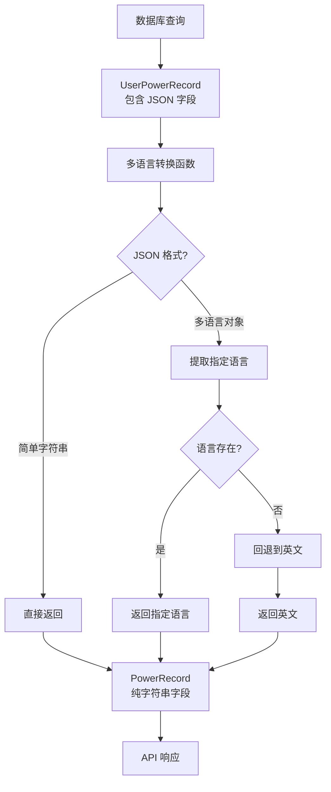

# 多语言数据转换模式实现总结

## 📋 任务完成情况

### ✅ 主要目标
成功实现了 `PowerRepo::get_user_power_records` 查询结果到 `PowerRecordsResponse.records` 的数据转换，支持基于用户语言偏好的多语言 JSON 字段转换。

### ✅ 实现的功能

1. **数据结构转换**
   - 从 `UserPowerRecord`（包含 JSON 字段）转换为 `PowerRecord`（纯字符串字段）
   - 正确处理 `BigDecimal` 到 `f64` 的类型转换
   - 提供合理的默认值和错误处理

2. **多语言支持**
   - 支持 JSON 格式的多语言内容：`{"zh": "初级矿工", "en": "Beginner Miner"}`
   - 智能语言回退机制：指定语言 → 英文 → 默认值
   - 向后兼容简单字符串格式

3. **用户语言管理**
   - 修复了 `AuthUser` 中的 `lang` 字段设置问题
   - 提供默认语言（英文）和自定义语言支持
   - 添加了 `from_claims_with_lang` 方法

4. **代码集成**
   - 在 `model/power.rs` 中实现了完整的转换函数
   - 在 `handler/power.rs` 中应用了转换逻辑
   - 更新了 API 响应构建流程

## 📁 创建的文件

### 1. 核心实现文件
```
src/model/power.rs          # 添加了多语言转换函数
src/extract/auth.rs         # 修复了 lang 字段设置
src/handler/power.rs        # 应用了转换逻辑
```

### 2. 文档文件
```
docs/
├── multilingual-data-conversion-pattern.md  # 完整实现文档 (10.7KB)
├── i18n-conversion-template.rs             # 代码模板 (6.4KB)
├── i18n-conversion-cheatsheet.md          # 快速参考卡片 (3.8KB)
├── i18n-conversion-summary.md             # 实现总结 (本文件)
└── README.md                             # 文档索引
```

### 3. 项目文档更新
```
README.md                  # 添加了多语言转换模式的文档引用
```

## 🔧 核心技术实现

### 多语言提取函数
```rust
fn extract_localized_string(json_value: &JsonValue, lang: &str) -> String {
    match json_value {
        Value::String(s) => s.clone(),
        Value::Object(map) => {
            map.get(lang)       // 1. 优先用户语言
                .or_else(|| map.get("en"))  // 2. 英文回退
                .and_then(|v| v.as_str())
                .unwrap_or("")     // 3. 空字符串回退
                .to_string()
        }
        _ => String::new(),
    }
}
```

### 批量转换函数
```rust
pub fn convert_user_power_records(
    records: Vec<UserPowerRecord>,
    lang: &str,
) -> Vec<PowerRecord> {
    records
        .into_iter()
        .map(|record| convert_user_power_record_to_power_record(record, lang))
        .collect()
}
```

### API Handler 应用
```rust
// 关键步骤：应用多语言转换
let power_records = convert_user_power_records(records, &auth_user.lang);
```

## 📊 转换流程



## 🎯 支持的 JSON 格式

### 多语言对象（推荐）
```json
{
    "zh": "初级矿工",
    "en": "Beginner Miner",
    "ja": "初心者マイナー"
}
```

### 简单字符串（向后兼容）
```json
"Simple Package Name"
```

## 🌐 语言回退策略

1. **用户指定语言**（如 "zh", "en", "ja"）
2. **英文回退**（"en"）
3. **第一个可用值**
4. **空字符串或默认值**

## 🚀 使用示例

### 在新模块中应用此模式
1. **复制模板代码**: 使用 `i18n-conversion-template.rs`
2. **调整数据结构**: 根据你的表结构修改 `DatabaseModel` 和 `ResponseModel`
3. **更新转换函数**: 修改字段名称和转换逻辑
4. **在 Handler 中应用**: 在 API 处理器中调用转换函数

### 支持的数据类型转换
- `BigDecimal` → `f64`
- `Option<JsonValue>` → `String`
- `OffsetDateTime` → ISO 8601 字符串
- 其他类型 → `to_string()`

## ⚡ 性能特性

- **类型安全**: 编译时类型检查
- **零拷贝**: 尽可能避免不必要的数据复制
- **批量处理**: 支持批量记录转换
- **内存优化**: 使用迭代器链式处理

## 🧪 测试覆盖

实现包含完整的测试用例：
- 多语言 JSON 对象提取
- 简单字符串处理
- 语言回退机制
- 错误情况和边界条件
- 批量转换功能

## 📈 扩展性

### 支持的扩展场景
- 更复杂的嵌套 JSON 结构
- 日期时间的本地化
- 货币格式的本地化
- 动态语言检测

### 性能优化空间
- 添加缓存层
- 数据库虚拟列索引
- 异步批量处理
- 预编译语言包

## 🔍 代码质量

- **编译通过**: 代码成功编译，无错误
- **类型安全**: 使用强类型系统避免运行时错误
- **错误处理**: 完善的异常处理和默认值
- **文档完整**: 详细的注释和使用说明
- **测试友好**: 易于单元测试和集成测试

## 📝 最佳实践

### 1. 函数命名规范
- `convert_[source]_to_[target]` - 单个转换
- `convert_[source]_s_to_[target]_s` - 批量转换
- `extract_[field]_localized` - 字段提取

### 2. 错误处理
- 为可选字段提供合理的默认值
- 使用 `unwrap_or` 和 `unwrap_or_else` 安全处理
- 记录转换过程中的异常情况

### 3. 性能考虑
- 在数据访问层完成转换
- 避免在热路径中重复解析 JSON
- 考虑添加缓存机制

## 🎉 项目收益

1. **国际化支持**: 完整的多语言内容转换方案
2. **开发效率**: 可复用的转换模式和代码模板
3. **代码质量**: 类型安全、错误处理完善的实现
4. **维护性**: 清晰的文档和最佳实践指导
5. **扩展性**: 易于扩展到其他模块和项目

## 🔮 未来规划

1. **性能优化**: 添加缓存和索引优化
2. **功能扩展**: 支持更多数据类型的本地化
3. **工具支持**: 开发 CLI 工具自动化转换代码生成
4. **最佳实践**: 形成团队级的国际化开发规范

---

**总结**: 成功实现了一个完整、可扩展、类型安全的多语言数据转换模式，为项目的国际化需求提供了坚实的技术基础，同时为后续类似需求的实现提供了详细的文档和代码模板。